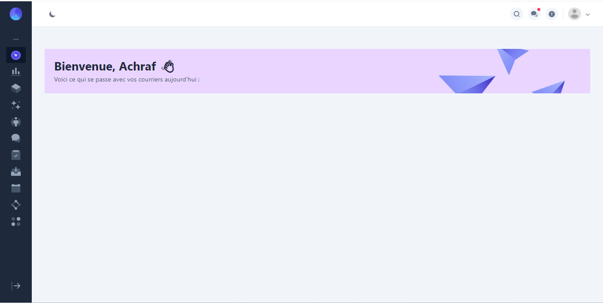
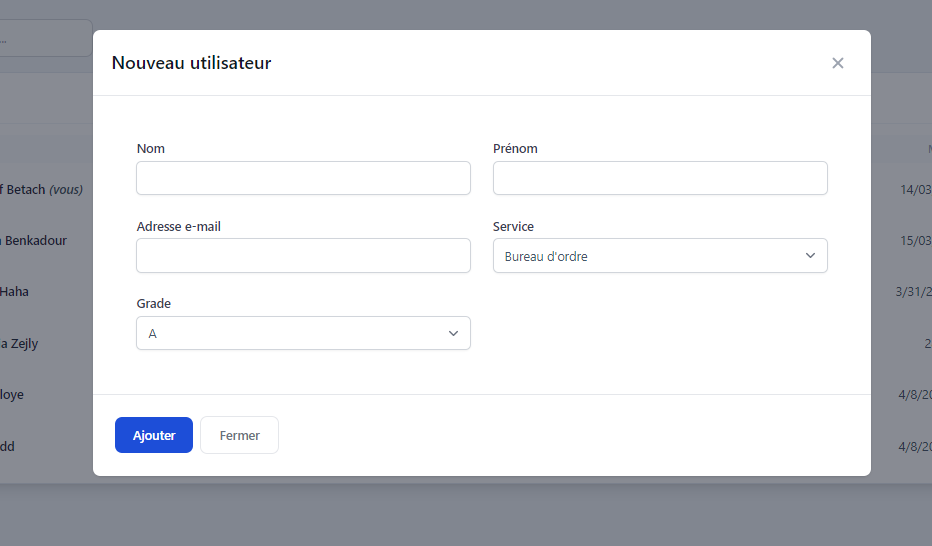
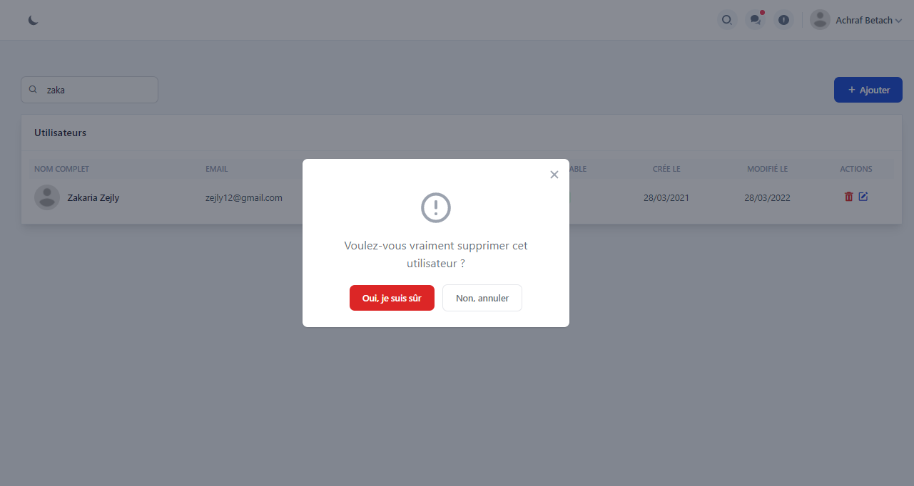
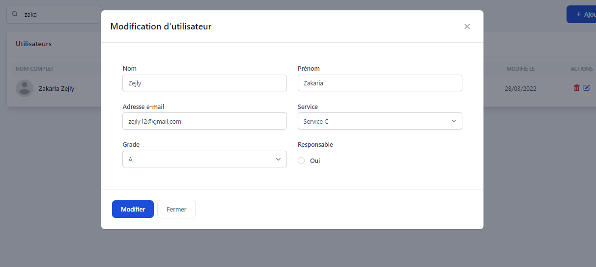
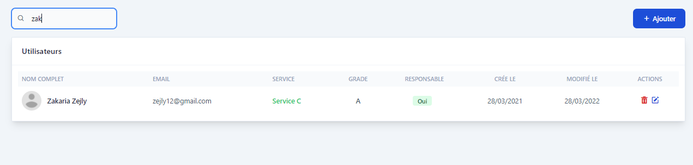
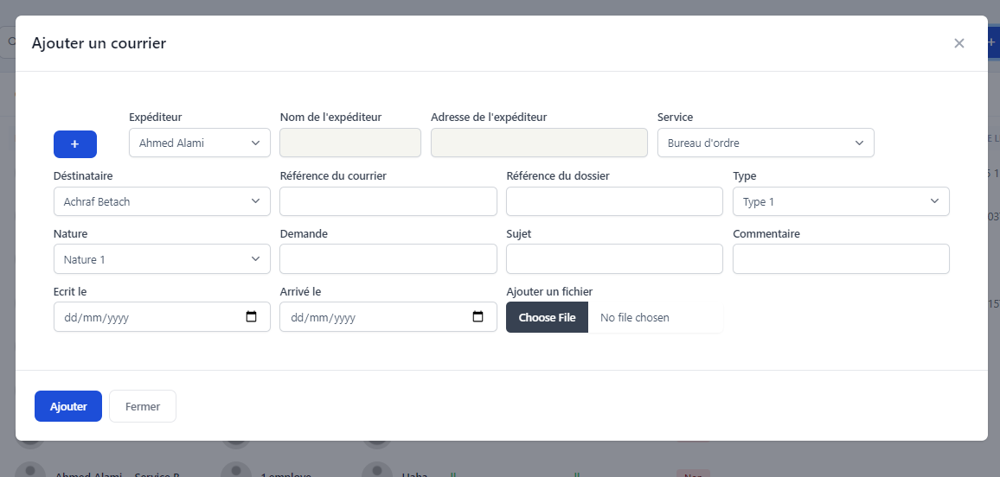
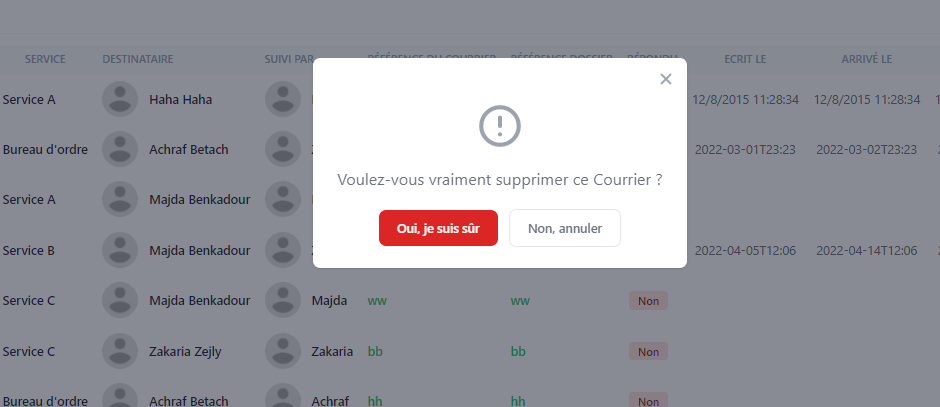
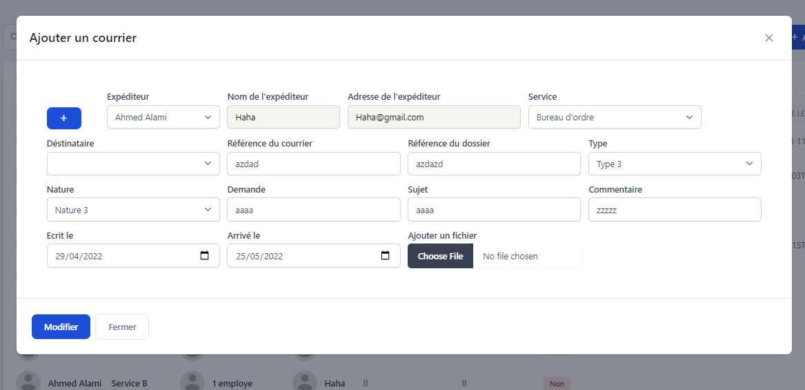
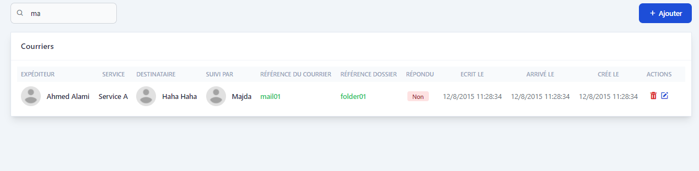

# <u>SYSTEME DE GESTION DES COURRIERS</u>

**Projet réalisé par** :

* Achraf betach

* Barbara hamza

* Zejly zakaria (group B)

* Assrar Othman

## Presentation General :

ce projet est realiser  on utilisant asp.net Framework, Sql comme base de donner, tailwind pour le design et model MVC.

- **Les PROCESSUS DU PROJET :**
  
  * La gestion des courriers.
  
  * La gestion des utilisateurs de l’application.
  
  * La gestion d’un système de notification pour les utilisateurs.

## l'interface de l'application et ses fonctionnalités

### 1. gestion des comptes utilisateurs :

* <u>**Login page :**</u>

* **<u>welcome page after login</u>**

* <u>**les fonctionnalités CRUD**</u>
  
  * **Ajouter**
    
    
  
  * **Supprimer**
    
    
  
  * **modifier**
    
    
  
  * **rechercher et lister (Ajax)**
    
    

### 2. Gestion des Courier :

* les fonctionnalités CRUD
  
  * **Ajouter :**
    
    
  
  * **Supprimer :**
    
    
  
  * **Modifier :**
    
    
  
  * **Rechercher et Lister (Ajax) :**
    
    

### 3. Gestion de Notification :

* **Demonstration des notification :**
  
  
